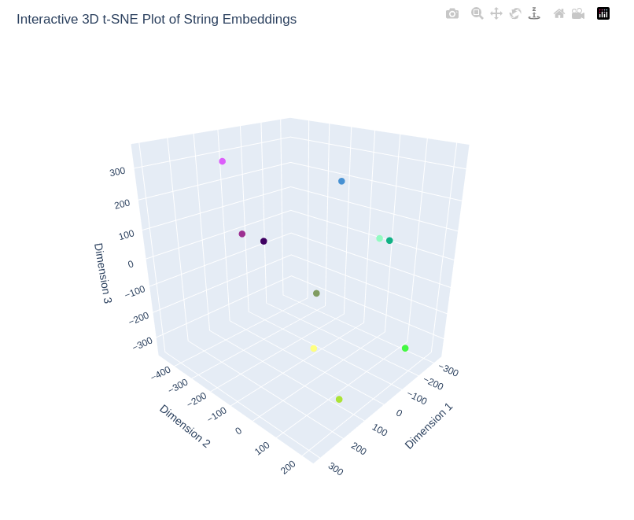

# semantic_analyzer



A simple utility for analyzing relationships between semantic embeddings of text strings and plotting them interactively in 2D or 3D using sklearn TSNE and plotly. Useful for evaluating and visualizing embedding performance on data samples.

Metrics include:
- mean pairwise similarity
- max pairwise similarity
- diversity score

After installing dependencies in requirements.txt, run
```
python3 semantic_analyzer.py
```
